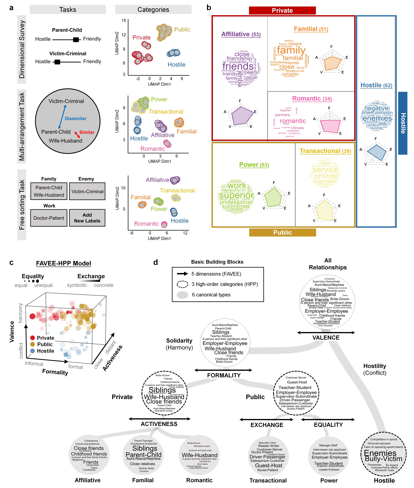
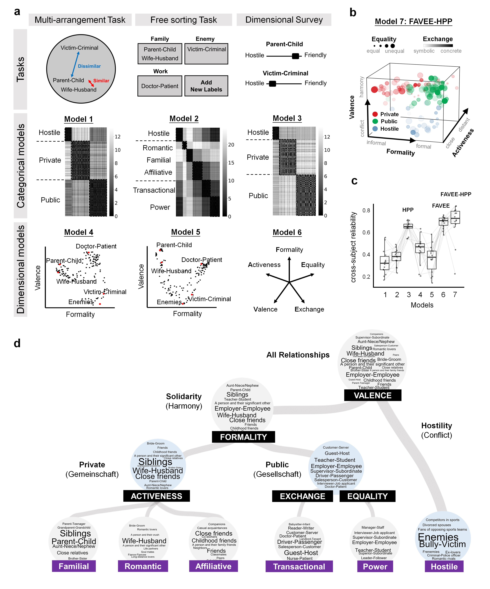
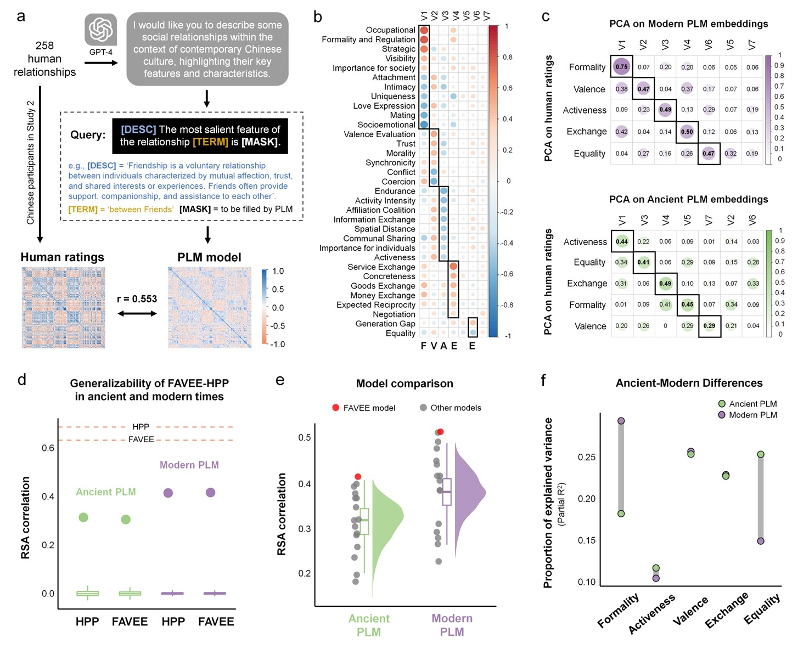

# Social-relationship-knowledge
## **Study 1: A unified representational space across disciplines**

### **A 5D model of human relationships (‘FAVEE model’)**

### **Categorical and dimensional representations of human relationships**

## **Study2 Universality and cultural variability across modern cultures**

## **Study 3: Relationship representations in history**

## **Method validation and power analysis in the Pilot study**

