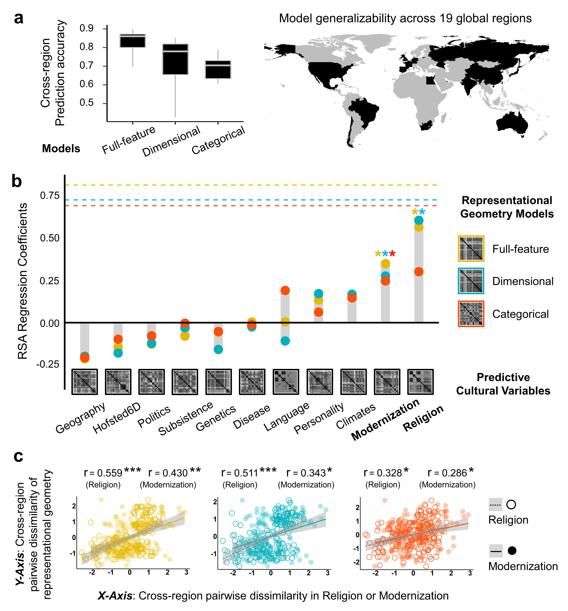

# Social-relationship-knowledge
# Study1 A 5D model of human relationships (‘FAVEE model’). 

# Study2 Categorical and dimensional models.

# Study3 Universality and Cultural Variability of Relationship Representational Geometries.

# Method validation and power analysis in the Pilot study.

