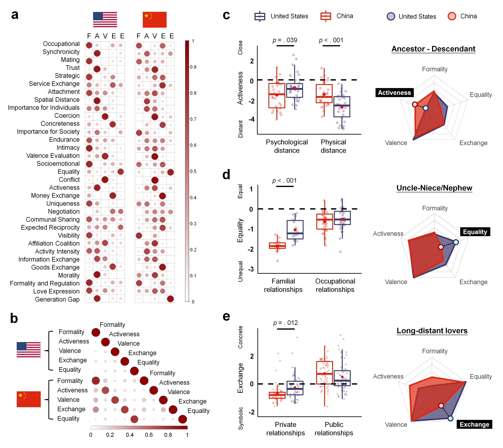

# DataClean_FAVEE_HPP

- codes
  - each_region: perform data cleaning and pca results (FAVEE) in each region
  - CategoricalModel_19regions.ipynb: categorical results (HPP) in each region
  - Meaning of FAVEE.ipynb: spearman’s correlations between a PCA component derived from one region and the FAVEE components derived from global n-1 aggregated data (with that region left out to avoid data double-dipping)
  - reliability.ipynb - to statistically test whether the world’s FAVEE structures are equivalent to regional FAVEE structures, we implemented split-half equivalence tests
  - Meaning of HPP.ipynb: jaccard index measuring the similarity between a cluster derived from one region and clusters derived from global aggregated data (with that region left out)
  - Demographic_RDM.ipynb: generate RDM for RSA regression
  - Plot_demographics.ipynb: there is a visualization of demographic information across all studies, and detailed information can be found in "Demographics.xlsx"
- files
  - Demographic_RDM.xlsx: demographic information for each region
  - dict_results: cleaned datasets formatted as dictionaries, ready for analysis or further processing
  - input_data/
    - Nations: raw data for each region
    - RelDim_labels: files necessary for the data cleaning process
    - dimensions_check.xlsx: details the dimensions within certain regions that require reversal, as well as the labels for PCA results across each region and the averaged results excluding one region (for correspondence test to evaluate the generalization of the FAVEE structures across the globe).  
  - output_data/
      - cleaning_results: cleaned data for each region
      - dataframe_results - this folder contains the raw data of scores for 159 types of interpersonal relationships across 33 dimensions for all regions
      - pca_results: pca results for each region
      - pca_each_region_labels: pca results for each region with corresponding dimension labels
      - categorical_model: clustering results and RDMs (159*159) based on clustering results for each region, formatted as binary matrices
      - demographic: demographics for each region
      - demographic_org: transformed demographic data to standardize varying formats into a uniform structure
      -  dimension_comprehension: comprehension of each dimension for each region
      - familiarity: familiarity of each relationship for each region
      - foils_rel_size: attention-check questions
      - outlier_df:  participant IDs identified as outliers
      - rdm: RDMs based on demographics and responses to attention-check questions
      - social_vs_nonsocial: raw data regarding the check size results for each region and correlation matrix between 19 regions derived from these check size results

# World_avg_results

- codes
  - Dimensional_model.ipynb: the averaged model scores across the 19 regions and corresponding pca results
  - Categorical_model.ipynb: categorical results including HPP model and FAVEE-HPP model based on averaged global results
  - Plot_FAVEE-HPP_model.ipynb: visualize FAVEE-HPP model within a cubic graph
  - FAVEE-HPP correlation.ipynb: correlation between FAVEE model and HPP model
- files
  - custom_function: a specialized function designed for clustering analysis
  - Total: averaged global results, pca results and categorical results

# Cultural RDM

- codes
  - Variables_rdm.ipynb: we created a representational dissimilarity matrix (RDM) for each cultural variable in which each cell represents the dissimilarity of two countries/regions on this variable (e.g. how dissimilar China and Portugal are, according to their Modernization level)
  - cultural_map.ipynb: 19 regions collected in Study2

- files
  - input_data: cultural variables collected from multiple open databases
  - rdm: RDMs based on various ecological, biological, and sociocultural variables

# RSA_Regression

To access which cultural variables account for the variance of social relationship knowledge representation across countries/regions, we performed a multiple regression similarity analysis (RSA).  

- codes
  - Models_rdm.ipynb: we created RDMs to represent the dissimilarity of relationship representation across regions

  - RDM_heatmap.ipynb: heatmap of cultural RDMs

  - LOOCV_Models.ipynb: Using leave-one-region-out cross-validation (LOOCV), we compared cross-region reliability among raw data, FAVEE model, HPP model, as well as single dimension. We also compared each relationship within 33 dimension space using LOOCV, and selected relationships belonging to respective category to represent cultural variability of HPP categories.

  - clustering of 19 regions.ipynb: We performed a hierarchical clustering to find which regions are similar to each other according to their social relationship representations. For each region, we generated a representational dissimilarity matrix (RDM) of the 159 relationships, by calculating their Euclidean distance on the 33 conceptual features. We calculated the Spearman correlation between regions’ relationship RDM and then used 1 minus the correlation value, resulting in a region-by-region RDM in which a higher value indicates higher dissimilarity between these two regions based on their social relationship representation. The RDM was first reduced to 2D space using UMAP and then hierarchical clustering was performed using the ‘hclust’ function in R.  

  - ReliabilityCrossRegions_159rels.ipynb: There is no correlation between the difference in cultural variability and familiarity in relationships.

  - RSA_Regression_main_text.ipynb / RSA_Regression_subvariables_extended_suppl.ipynb

    We performed a linear regression model in which cultural variable RDMs were predictors, relationship representation RDM was the response variable. For our purpose here, the regression RSA measures how the similarity structure of the response variable (i.e., relationship representation) may be predicted by the similarity of the predictive variables (e.g., Modernization, Languages, etc.). We also added non-social object knowledge as a predictor in the follow-up analysis.   

- files

  - output_data
    - models_rdm: RDMs based on raw data, FAVEE model, and HPP model, as well as the single dimension and cluster
    - loocv: loocv results of raw data, FAVEE model and HPP model
    - rsa_results: regression coefficients and p-values obtained through permutation test
    - clustering_19regions: clustering results of 19 regions
    - familiarity: familiarity of relationships across 19 regions

# CHNvsUSA  

There were two rounds of data collection for China. The relationships in the first round were directly translated from 159 relationships in the United States **(CHN_Trans_DataCleanPCA.ipynb)**, while the relationships in the second round were generated using NLP **(CHN_NLP_DataCleanPCA.ipynb)**. There was a high correlation between the translation results and the NLP results.

To compare CHN and USA, we combined the USA data from Study1 and Study3. **(USA_DataCleanPCA.ipynb)**.  

CHN VS USA:  
- Similarity_33&30d.ipynb  
The dimensional frameworks of the two countries are highly correlated.  
- Difference  
The different between the two countries in relationship knowledge.  

    - neighbors_of_neighbors
      Beyond cultural difference between CHN and USA, we also explore other regions deeply. We focus on the concept of "Neighbors".  
      We found the more modern a region is, the concept of “Neighbors” in this region is more formal and distant. **(Modern_correlation.ipynb)**  
      As examples of cultural differences, we showed results of CHN, Israel, and the United States. **(Plot Neighbor.ipynb)**

# Mosuo

To validate the universality of our FAVEE-HPP model, we visited a traditional non-industrial society—the Chinese Mosuo tribe, a small-scale matrilineal society living near Lugu Lake in the Tibetan Himalayas. We conducted a validation of the FAVEE-HPP model on the Mosuo tribe.

- codes
  - plot_FAVEE.ipynb - Analysis of the FAVEE model for the Mosuo data.
  - plot_HPP.ipynb - Analysis of the HPP model for the Mosuo data.
  - cube.ipynb - Unified visual representation of the FAVEE-HPP model structure for the Mosuo data.
- files
  - CHN_dim_rel_scaled_NLP_159r_33d.csv-Data of 159 interpersonal relationships of the Han Chinese on 33 dimensions
  - Total_scale_var_33v.csv-Data of 159 interpersonal relationships from 19 regions around the world on 33 dimensions.
  - labels_different_versions.csv-In different datasets, we had inconsistent types of labels for the same interpersonal relationships, such as "Between Siblings" and "siblings." We have made corrections to standardize the label.
  - rels_simple.csv-Abbreviations for the 159 types of interpersonal relationships.
  - Mosuo data are available from the corresponding author on request.
    - dim_rel_mosuo_avg_scaled.csv-Data of 159 interpersonal relationships of the Chinese Mosuo tribe on 33 dimensions.
    - mosuo_FAVEE_scores.csv-The scores of 159 types of interpersonal relationships of the Mosuo tribe on FAVEE.
    - mosuo_5c_3k.csv-The scores of 159 interpersonal relationships of the Mosuo tribe on FAVEE and the labels on HPP.

# Subset  

- Robustness/ Robustness Test.ipynb 
  We quantified the robustness of our results across different numbers of social relationships as Lin (2021) did. We removed social relationships one by one and reperformed PCA to extract five dimensions as before (all pairs of social relationships were ranked from the most to the least similar rated in multi-arrangement task, and the social relationship with lower familiarity rating was removed from each pair). The correlations were calculated between the loadings of each dimension from the full set versus the subsets of relationships as the robustness of our results.  

- full&dimension_model.ipynb / category_model.ipynb + models_rdm.ipynb 
  From the full set of each region, we derive the full feature, dimensional, and categorical models for each subset. Then we created RDMs to represent the dissimilarity of relationship representation across countries/regions.  

- regression_categorical.ipynb / regression_dimensional.ipynb / regression_full_feature.ipynb 
  RSA regression results derived from the subset. We report the effect of modernization and religion on different models using the same RSA analysis procedural as mentioned above.  

- data 
  The remaining subsets after removing one relationship at each step.